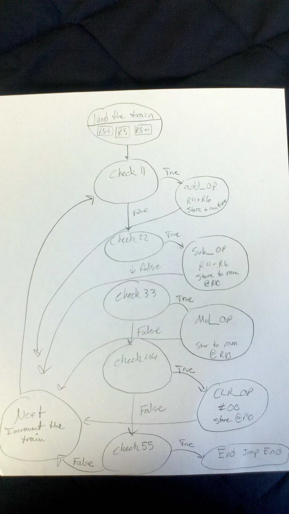
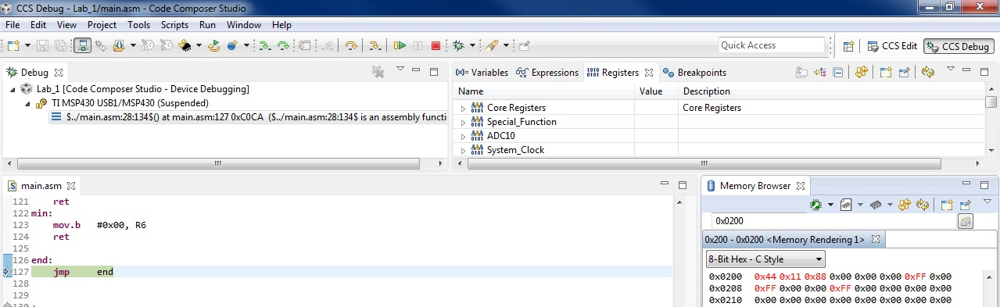

ECE382_Lab1 
=============
A simple assembly language calculator

## Objectives and Purpose
The object of Lab 1 is to create a simple assembly language calculator that reads a series of instructions,
performs the desired operations, and stores the result to memory. The required functionality includes:
  * ADD_OP - 0x11
  * SUB_OP - 0x22
  * CLR_OP - 0x44
  * END_OP - 0x55
  
Additionally, Lab 1 will also be able to perform:
  * Setting results to a maximum of 255 and a minimum of 0 when they exceed those bounds
  * MUL_OP - 0x33 
  
## Implementation Plan


## Code
### Initialization

```
main:
	mov.w   #__STACK_END,SP				; BOILERPLATE	Initialize stackpointer
	mov.w   #WDTPW|WDTHOLD,&WDTCTL 		; BOILERPLATE	Stop watchdog timer

	mov.w	#store, R10		; Register 10 is a pointer to RAM

	mov.w	#ts,  R5					; Register 5 is a pointer to the case test string
	mov.b	@R5+, R6					; R6 = value @ M[R5-1] and holds the first operator (usually the result)
	mov.b	@R5,  R7					; R7 = value @ M[R5] and holds the operation
	mov.b	1(R5),R8					; R8 = value @ M[R5+1] and holds the second operator
```

This section of code draws heavily upon lec6.asm which was an example program in class that performed the same
function as what was required of this code. The intent of this block is to:
 * Initialize a pointer (R10) that points to the beginning of the desired block of results storage in RAM
 * Initialize a pointer (R5) that points to the location of the test string in ROM
 * "Load the train" by placing the first operand in R6, the operation in R7, and the second operand in R8

The fundamental difference between this block and the one from lec6.asm is the way that R5 is incremented. Instead
of advancing R5 to position 3 in the test string it is left at position 1 which will be significant in later lines of 
code.

### Operation Checks

```
check11:								   ; The following blocks just check for operations and then
	cmp.b	#add_val, R7			;jump to the next check or the appropriate operation
	jne		check22
	jmp     add_op

check22:
	cmp.b	#sub_val, R7
	jne		check33
	jmp     sub_op

check33:
	cmp.b	#multiply_val, R7
	jne		check44
	jmp		mul_op

check44:
	cmp.b  #clear_val, R7
	jne	   next
	jmp    clr_op
```

This block of code also heavily relies on lec6.asm. I found it to be the most straight forward way to accomplish the 
task of checking R7, which holds the operation, for which particular operation it held. This is easily accomplished
with a compare and jump if not equal statement. I decided to leave the numeric "check11" labels the same as lec6.asm
They were short and descriptive and by looking where check11 jumps to if it is equal you know what 0x11 codes for. 
You'll notice I didn't put the actual operations under the checks. This was to promote readability, modularity, and
ease of reuse of code. 
	
### Next (Increment the train)
	
```
	next:
	cmp.b	#end_val, R8
	jeq		end
	incd.w	R5
	mov.b	@R5, R7					 ; Double increment keeps R7 on 1,3,5... which is the operation
	mov.b	1(R5), R8				; One past @R5 is always the second operand
	jmp		check11
```
	
This block of code caused me a lot of heartache early on in development. In lec6.asm R6 always held -1(R7) which 
wasn't very useful for Lab 1 because R6 needed to hold the result of the last operation to be an operand in the
next operation (usually). To fix this issue, I allowed the individual operations to store their results into R6
so I wouldn't have to worry about loading it up in "next:" for the next operation and I changed the way I moved
the test string pointer. R5 is now double incremented. This allows R5 to stay on position 1,3,5,7... and so on.
The significance of this is that since operations are always stored at odd locations, R5 always points to the 
operation. R8 was easy because, as the comment says, one past the operation is always the second operand. 
	
### ADD_OP
	
```
add_op:								; Adds the second operand (R8) from the result (R6)
	add		R8, R6
	call	#min_max
	mov.b	R6, 0(R10)
	inc.w	R10
	jmp		next
	
```

This block is pretty straightforward. The second operand is added to the first which now holds the result. It 
calls the min_max subroutine which will be discussed later. Stores the result to memory and increments the 
storage pointer.

### SUB_OP
	
```
	sub_op:								; Subtracts the second operand (R8) from the result (R6)
	sub		R8, R6
	call	#min_max
	mov.b	R6, 0(R10)
	inc.w	R10
	jmp		next
	
```
	
This block is also pretty straightforward. It performs the same functions as ADD_OP except it subtracts the operands.
	
### MUL_OP
	
```
	mul_op:								  ; Multiplies using the shift/addition algorithm
	mov.b	R6, R9					    ; R9  = multiplicand
	mov.b	R8, R11				    ; R11 = multiplier
	clr.b	R12  					     ; R12 = result
	mov.b   #0x08, R13	  ; R13 = loop counter initialized to the word size
checkbit:
    rra 	R11						  ; Determines if the LSB of a rotated multiplier is 1
    jnc		mul_loop
    add		R9, R12				; If so it adds the multiplicand to the result (A x 1 = A)
mul_loop:
	rla		R9						      ; Shift the multiplicand as the place value of the multiplier goes up
	dec		R13
	jnz		checkbit
mul_finished:
	mov		R12, R6					  ; R6 is our result
	call	#min_max
	mov.b   R6, 0(R10)
	inc.w	R10
	jmp		next
```
	
MUL_OP was probably the most complicated section of the whole program. I needed to do research on multiplication
algorithms to even begin. What I found was as the most commonly used algorithm is the shift/add algorithm. A
detailed example of this algorithm can be found [here](http://www.zeepedia.com/read.php?manipulations_multiplication_algorithm_shifting_and_rotations_bitwise_logical_operations_assembly_language_programming&b=5&c=4)
which is also where I learned how to do it. What this block is doing in essence is checking to see if the LSB of the 
multiplier is a 1. If it is the multiplicand is added to the result. Then the multiplicand is rotated left to increase
its value by a factor of two which accounts for the fact that when we got to check the next least significant bit of the	multiplier (accomplished here by rotating right and checking the carry flag) we'll actually be multiplying by the next 
place value which is always two times more that the proceeding one. We repeat this process 8 times because we are
multipling bytes which have 8 place values to check. Again, the link above was very useful in explaining the algorithm and    showing an easy implementation in assembly. No mention was made as to whether this implementation multiplies in O(n) time or
O(log n) time so I leave that to the evaluator. 
	
### CLR_OP
	
```
	clr_op:								; Stores 0x00 to memory
	clr.b   0(R10)
	mov.b   R8, R6					; moves the second operand into the first operand (R6) for next op
	inc.w	R10
	jmp		next
	
```
	
CLR_OP clears the byte stored in RAM pointed to by 0(R10). It then takes the second operand and places it into the
first for the next operation as per the instructions. 
	
### min_max
	
```
	min_max:							; Checks to see if R6 higher than max or lower than min
	tst		R6						; If R6 is negative (less than 0x0000 which is the min) jump to min
	jn		min
	cmp		#max_val, R6				; If R6 higher or the same as max jump to max
	jhs		max
	ret
max:
	mov.b	#max_val, R6
	ret
min:
	mov.b	#min_val, R6
	ret
	
```
	
"min_max" was my first use of subroutines in assembly. I saw a need for a subroutine because each operation, with the 
exception of CLR_OP, had the chance of breaking the min and max values established by functionality b requirements.
Instead of putting this block into every operation, I chose to increase readability and reusability by breaking 
this requirement into a subroutine. Each operation makes a call to min_max after it has performed its operations
and placed the result in R6. If R6 is greater than 0x00FF it writes 0xFF to R6 and returns. Likewise if R6 is negative,
which is to say less than zero, then 0x00 is written to R6 and it returns. If neither is true min_max just returns 
without altering the value of R6. This function taught me the importance of working the bit versus the whole word. 
In this case we need to work with the whole word otherwise we can lose information. For instance, in the a functionality
test case a result of one of the addition ops is 0x01FE. If I were to use cmp.b #0xFF, R6. Then R6 would be unaltered
because 0xFE is less than 0xFF, when in reality R6 holds 0x01FE. I also learned to be careful with my use of tst.
I originally had it after the cmp which didn't work because cmp was setting the status flags I needed to check 
with tst which was screwing with my results. Luckily, the fix was as easy as putting tst first. 
	
### end
	
```
	end:
	jmp	    end
```
	
"end" is a simple CPU trap to trap the CPU once a end operation was discovered in "next:"
	
## Debugging/Testing

### Methodology

Ambitiously, I loaded the A Functionality test case into the test string at the very beginning of my testing. My thinking
was that because the A functionality presented operations in order of increasing difficulty I could measure my progress
by looking at the early results and then building to the middle and later results. I would run the program through this
test case, look at the results, guess where something went wrong and insert a breakpoint, restart the program, and step 
through the operation of interest. This method worked very well and allowed me to achieve a final product in about 4 
iterations. 

### Commit 1

This commit was little more than a copy of lec6.asm to serve a as a springboard for further commits. I hadn't really 
read the problem statement too well at this point and thought that lec6.asm and the problem were doing similar
things. As the commit description says however, it's just a basic skeleton to build off of. I noticed my program was
only doing the first result correctly. I found that my "train" registers weren't being loaded correctly and I knew this
was going to be an emphasis on the next commit. I reread the problem and started on commit 2.

### Commit 2

On this commit I corrected the way the test string pointer was incremented so that it always pointed to operations. This
correction stayed through to the final product and can be seen in my discussion of the "next" above. This was more inline 
with the lab 1 requirements. I also attempted to implement the MUL_OP instruction. My first seemed to work but as I found
out in later testing it still needed some tweaking. 

### Commit 3

This commit added the min_max functionality. At first it appeared to work but I again found out that it needed some work
in later testing. 

### Commit 4

I found my final bug in this commit. My min_max functionality was not working as indicated by incorrect values being stored to memory when results should've exceeded the min and maxes laid out by the lab. What I discovered was that I had foolishly added
a .b for bit operation to many operations that didn't need it. As a result I was only comparing, adding, testing, and subtracting bits which gave me incorrect results. What I reasoned was that I could pretty much leave out the .b on everything
except for the final mov.b instructions to memory. 

### Final Commit

I removed some unnecessary moves to intermediate registers in the add and subtract. I also changed some of my jump instructions to improve readability. I was using jz when I should've been using jeq for example. I also cleaned up my clear
op by using clr.b instead of a mov.b #0x00 which helps with readability. Below is the result of this build when run on the 
a functionality test case. 



## Conclusion and Lessons Learned
Coming Soon!
